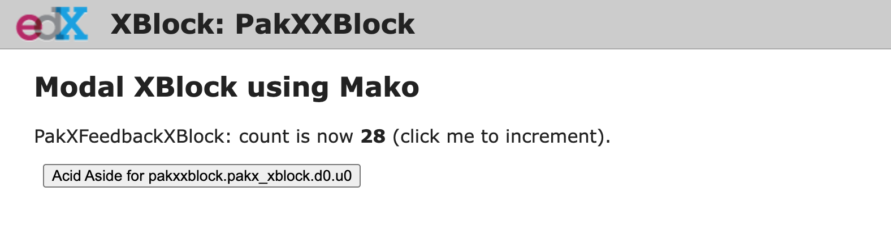
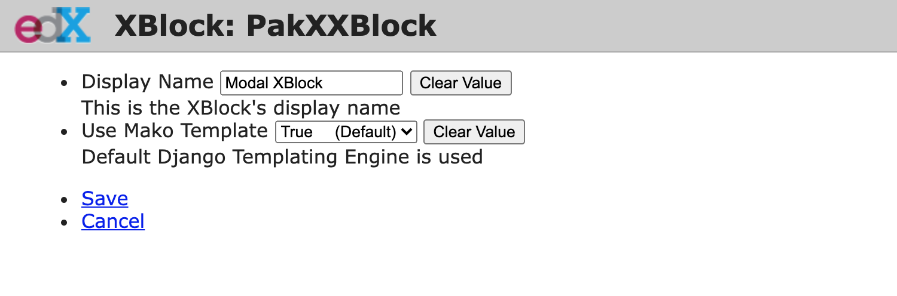

PakistanX XYZ
---------------------------------------------

This XBlock allows Learners to  

Dev Notes
------------
Static assesets entries can be found in  `XBlockFragmentBuilderMixin`, which includes `static_js, static_js_init and template names`
Fields for XBlock can be added in `XBlockFieldsMixin`
Student view context can be updated in `ModalViewMixin`

Installation
------------

Install the requirements into the python virtual environment of your
``edx-platform`` installation by running the following command from the
root folder:

    pip install -e git@github.com:PakistanX/pakx-xyz-xblock.git@release-v0.1.0#egg=pakx_xyz

Enabling in Studio
------------------

You can enable the PakX XYZ XBlock in studio through the
advanced settings.

1. From the main page of a specific course, navigate to
   `Settings -> Advanced Settings` from the top menu.
2. Check for the ``advanced_modules`` policy key, and add
   ``"pakx_xyz"``.
3. Click the `"Save changes"` button.

Usage
-----

The PakistanX XYZ .... Add the PakistanX XYZ 
component to a lesson, then click the `EDIT` button.

Details here

Details here

Running the workbench
---------------------
`python manage.py runserver 8000`

Access it at 

`http://localhost:8000/` <http://localhost:8000>.
